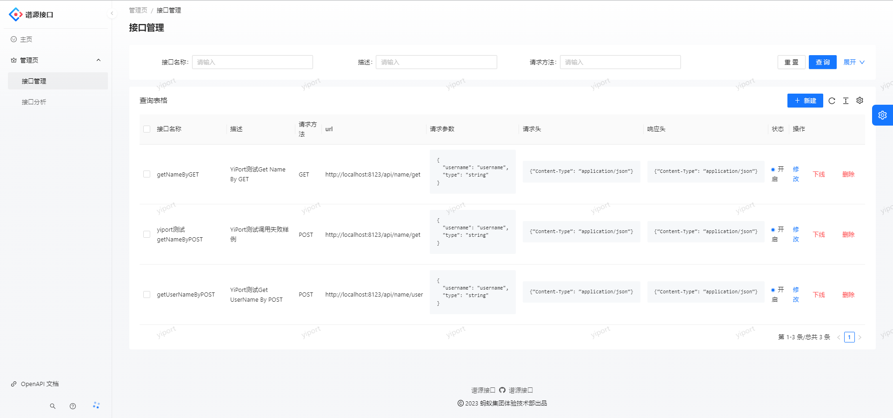

  <h3 align="center">谱源API开放平台</h3>
  <h4 align="center">YiPortApi后端项目</h4>
  

    <a href="https://github.com/YiPort/yp_api"><strong>YPApi后端项目 »</strong></a>
     
    <a href="https://github.com/YiPort/yp_api_frontend"><strong>YPApi前端项目 »</strong></a>
     
  

***
## 项目简介
此项目是[后端项目](https://github.com/YiPort/yp_api) ，请搭配 [前端项目](https://github.com/YiPort/yp_api_frontend) 使用。
一个提供 API 接口供开发者调用的平台。
管理员可以接入并发布接口，统计分析各接口调用情况；用户可以注册登录并开通接口调用权限，然后可以浏览接口及在线调试，还能使用客户端 SDK 轻松在代码中调用接口。

## 技术选型
整体结构

- [前端项目](https://github.com/YiPort/yp_api_frontend)
  - Ant Design Pro
  - React
  - Ant Design Procomponents
  - Umi
  - Umi Request (Axios的封装)

- [后端项目](https://github.com/YiPort/yp_api)
  - Java
  - Spring Boot
  - MySQL 数据库
  - MyBatis-Plus 及 MyBatis X 自动生成
  - API 签名认证（Http 调用）
  - Spring Boot Starter（SDK 开发）
  - Dubbo 分布式（RPC、Nacos）
  - Spring Cloud Gateway 微服务网关
  - Hutool、Apache Common Utils、Gson 等工具库
>后端模块整体结构
> 
> 

## 项目特点

- 根据业务流程，将整个项目后端划分为 web 系统、模拟接口、公共模块、客户端 SDK、API 网关这 5 个子项目，并使用 Maven 进行多模块依赖管理和打包。
- 使用 Ant Design Pro 脚手架 + 自建 Spring Boot 项目模板快速构建初始 web 项目，并实现了前后端统一权限管理、多环境切换等基础能力。
- 为防止接口被恶意调用，设计 API 签名认证算法，为用户分配唯一 ak / sk 以鉴权，保障调用的安全性、可溯源性（指便于统计接口调用次数）。
- 为解决开发者调用成本过高的问题，基于 Spring Boot Starter 开发了客户端 SDK，一行代码 即可调用接口，提高开发体验。
- 选用 Spring Cloud Gateway 作为 API 网关，实现了路由转发、访问控制、流量染色，并集中处理签名校验、请求参数校验、接口调用统计等业务逻辑，提高安全性的同时、便于系统开发维护。

## 项目业务流程

## 项目展示
### 登录界面

### 主页（浏览接口）

### 接口管理界面

### 在线调试界面
**调用成功：**

**调用失败：**

### 接口分析界面

### 使用自己开发的客户端 SDK，一行代码调用接口：

## 数据库文件
[数据库文件传送门](./sql)

